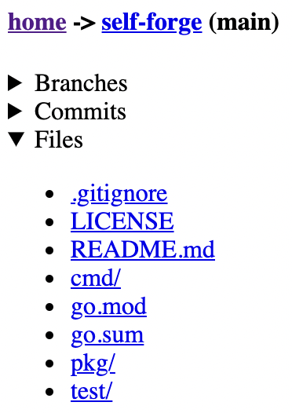

# self-forge

_(Under construction)_

Self-host your GitHub repositories and serve them with a lightweight user interface (no JS or CSS).



## TODO

- Server-rendered method to highlight lines of code.
- Add pagination to the GitHub API to get all public repositories.
- Run (and proxy) a git server to allow `git clone` from this mirror.
- e2e tests (currently there's some integration tests).

## Run

- `PORT` serve from `:{PORT}`
- `GITHUB_USERNAME` clone/fetch/pull/host this account's public repositories

```bash
PORT="80" GITHUB_USERNAME="healeycodes" go run ./cmd
```

## Test

```bash
go test -v ./test
```